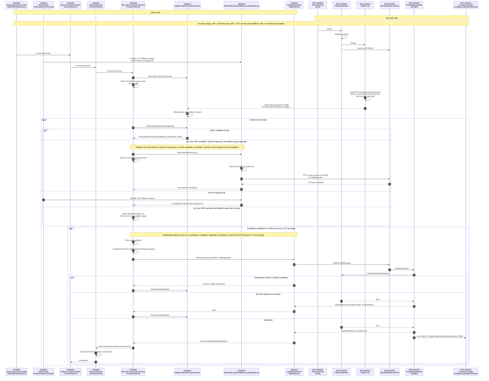

# Discovery Notes

This document describes the current recorder-viewer discovery strategy. The strategy is intentionally pragmatic because Android UDP broadcast delivery has proven unreliable across devices, routers, and internet/no-internet WLAN setups.

## Current Strategy

FoosVision currently uses one primary discovery path and one fallback path:

- UDP recorder announcements are the preferred path.
- Local TCP handshake probing is the viewer-side fallback when UDP announcements do not arrive.

Both paths converge on the same recorder handshake. A device is treated as a usable recorder only after it accepts the FoosVision handshake on TCP port `5555`.

## Ports

- UDP `5560`: recorder discovery announcements.
- TCP `5555`: recorder-viewer handshake.
- UDP `5561`: RTP/H.264 live video from recorder to viewer.

Other recorder channels are not part of discovery. The recorder binds them at startup, and the viewer connects to them only after a successful handshake.

## Discovery Sequence



## Details

Recorder UDP announcements use this identity format:

```text
FoosVisionRecorder|proto=1|app=1.0.0
```

The protocol version is authoritative for compatibility. The app version is diagnostic metadata and is not used by the viewer to reject otherwise compatible recorders.

Discovery is IPv4-only. The recorder broadcasts on each active non-loopback local interface to `255.255.255.255`, to the interface broadcast address when available, and to a pragmatic `/24` broadcast address such as `192.168.1.255`. The announcement interval is one second for the first minute after discovery starts, then three seconds.

The Android viewer keeps one UDP discovery session open while disconnected. It checks for candidates every 200 ms when no candidate is currently available. TCP fallback probing runs only while the viewer is in the foreground, is delayed by a four-second grace period, and can run again only after another four seconds. There is no separate pairing-cycle timeout; a started TCP fallback probe run is not interrupted by an outer discovery budget. Real handshake attempts are bounded per candidate by a three-second timeout.

TCP fallback probing is only a candidate source. It scans the viewer's active WiFi `/24`, uses short TCP connect attempts against port `5555`, and does not send a `HelloRequest`. A candidate becomes a usable recorder only after the normal FoosVision handshake succeeds.

## Handshake And Video

Both discovery paths use the same handshake endpoint:

```text
tcp://<recorder-ip>:5555
```

The viewer sends its selected local IPv4 address in the `HelloRequest`. The recorder returns protocol version, recorder app version, diagnostics settings, and viewer runtime settings. The handshake client uses a fresh NetMQ request socket per attempt so timeouts or failed candidates do not poison later attempts.

After a successful handshake, the recorder streams RTP/H.264 over UDP to the viewer on port `5561`. On Android, the recorder binds the app process to WiFi while active and binds the RTP socket to the local IPv4 address that matches the viewer route. This avoids sending video through the wrong interface when WiFi and mobile data are both active.

The recorder keeps discovery active after a viewer connects. Additional viewer handshakes are rejected while one viewer is connected, but the recorder remains discoverable.

## Operational Interpretation

Useful log indicators:

- `DiscoveryAppVersion=1.0.0`: UDP announcement path worked.
- `DiscoveryAppVersion=android-direct-probe`: UDP discovery did not provide a candidate after the fallback grace period; TCP probing found the recorder.
- `Android recorder fallback probing enabled because the viewer is in the foreground.`: TCP fallback probing is allowed again after a foreground transition.
- `Android recorder fallback probing disabled because the viewer is not in the foreground.`: TCP fallback probing is blocked after a background transition.
- `Android recorder fallback probing run started`: one TCP fallback probing run started. This is logged once per run, not once per probed IP address.
- `Android recorder fallback probing run completed`: one TCP fallback probing run finished, including the number of found candidates.
- `Android recorder fallback local WiFi addresses. Addresses=<none>`: the viewer could not determine an active WiFi IPv4 address.
- `Acquired WiFi multicast lock for viewer discovery.`: Android acquired the multicast lock used while the viewer page runtime is attached.

Known practical behavior:

- Some Android/router combinations do not reliably deliver UDP broadcast announcements to the viewer.
- The TCP fallback is more active than pure beacon discovery, but it is limited to the viewer's local `/24`, uses short timeouts, and runs only while disconnected and foregrounded.
- A future cleaner replacement would be an explicit UDP query-response discovery path or mDNS/Bonjour-style discovery. The current TCP fallback is a pragmatic reliability measure for local two-device setups.
